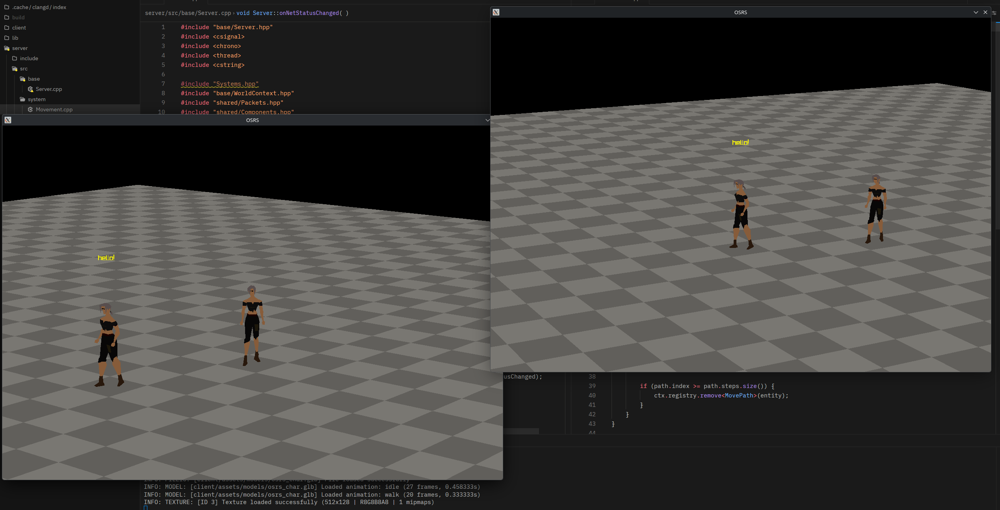

# OSRS Sandbox

> **Experimental / work in progress.** A tech playground, not a game.

A from-scratch experiment recreating the feel of Old School RuneScape's tile movement and netcode, built in C++ with raylib, EnTT, and GameNetworkingSockets.

## What it is

A tile-based multiplayer movement demo with a client-server architecture, aiming to replicate the core feel of OSRS: grid movement, isometric-ish camera, character animations, and a persistent world. The server runs an authoritative game loop with A* pathfinding and tile collision; the client handles rendering, input, and smooth movement interpolation between server ticks.

## Current state

- Multiple clients can connect and see each other move in real time
- Click-to-move with server-side A* pathfinding and tile collision flags
- Heightmap terrain rendered from a binary map chunk (`.omap`), with checkerboard tile shading
- Skeletal character model with walk/idle animation blending
- Smooth heading interpolation when turning
- Isometric camera with zoom, keyboard orbit, and middle-mouse drag pan; smoothed follow
- In-game text chat with floating chat bubbles above characters
- Standalone world editor for painting tile heights and collision flags and exporting map chunks

---

*Not affiliated with or endorsed by Jagex. Old School RuneScape is a trademark of Jagex Ltd. This is an independent, non-commercial learning project built from original code.*
